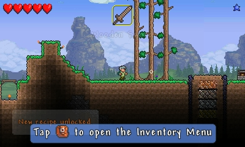

# Welcome to the RPG tutorial creation research

In this page you're going to find a personal research about the RPG tutorials with some good and bad examples as well as a guide on how to make your own tutorial with good advises

From what i can gather, the book "Learn to play: Designing tutorials for video games" is a great start into the understanding of what is a tutorial itself and how to implement them more naturaly. The author's book, Mathew M. White, has years of studies in psychology, education in the video game department, human-computer interaction and user interface experience han he compiles all his experience to help game designers to make their game's tutorials feel more dynamic. The book allso offers easy to implement changes to help your educate new players into your game and engage the more experienced playerbase.

## Comparison between one rpg game tutorial vs a non rpg game

### Terraria's tutorial

For the non RPG game we will take "Terraria", the game is listed in steam as a Sandbox-Survival game and we can say it's also a action-adventure game

(Terraria's tutorial for 3ds)

As we can see in the image the game shows you the ropes with kick guides in the inferior part of the screen such as how to open it's inventory.

Terraria's tutorial also feature a pre-scipted world hepling you find diferent objects to get used to the game's mechanics.

As for a good RPG game tutorial we will take Persona 5 Royale.

The game starts in the middle of the action, guiding you through a small section of the game, it teaches you how to move around in diferent modes and what to do in fights, eting you target your enemies weakneses.

### Persona 5 Royale battle tutorial:

Your main objective to achieve easy to win battles is go for the hold up mode, in this mode all enemies are downed and you have 3 options, but there's only 2 usefull ones, those being:

- All Out attack.

This is an attack involving all of your teamates to deal massive damage to all your enemies, easy to end battles

- Talk mechanic.

With this you can threaten your enemies so that they give you money, items or their own power. (This mechanic is not seen in the tutorial as it is intended to let you see the All out attack).

(Persona 5 Royale main combat features)

(Persona 5 Royale hold ups mechanic)

(Persona 5 Royale all out attack)

## bibliography

- [Terraria's tutorial](https://terraria.gamepedia.com/Tutorial)

- [Learn to play book reference](https://www.routledge.com/Learn-to-Play-Designing-Tutorials-for-Video-Games/White/p/book/9781482220193)

-

-

-
