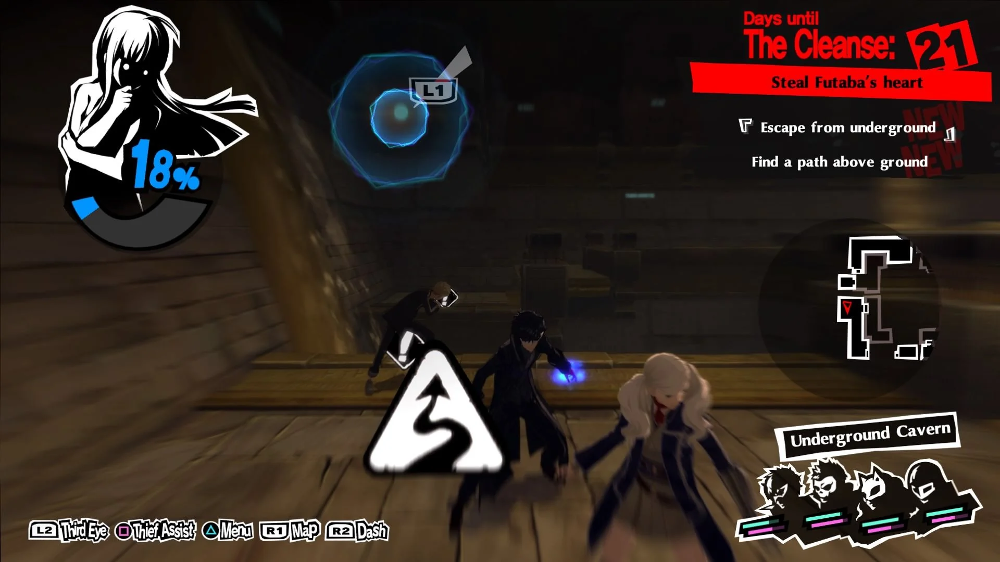

# Welcome to the RPG tutorial creation research

# Introduction

In this page you're going to find a personal research about the RPG tutorials with some good examples as well as a guide on how to make your own tutorial with good advises.

From what i can gather, the book "Learn to play: Designing tutorials for video games" is a great start into the understanding of what is a tutorial itself and how to implement them more naturaly. The author's book, Mathew M. White, has years of studies in psychology, education in the video games department, human-computer interaction and user interface experience. He compiles all his experience into his book to help game designers make their game's tutorials feel more dynamic. The book also offers easy to implement changes to help you educate new players into your game and engage the more experienced playerbase.

The key questions when playing the tutorial of a game should be: What am I doing? How do I do it? And why am I doing it?

Making the tutorial of a game one of it's more important parts, if your tutorial does not answer these specific questions you may consider changing it a bit.

# Market Study

You have to do a market study before launching your game some good advises i'm seeing online are:

- First of all, inspect your own game, in wich genres does it belong?

- We are going for an RPG with clasic combat involving turns as mechanics.

- Do not look for those games everyone knows or why they did succed in the first place.

- Instead look for those game that over perfomed, those no one knew that even existed in the first place but now have a great revenue.

- Hype is a double edged sword, handle it carefully.

- Listen to the fans of the genres itselves, try to figure out the key mechanics everyone loves/hates.

# Selected aproach

- The tutorial should present every key feature of your game, it can be more or less obvious inside the story, but you should try to implement a tutorial that also goes with the game's story.

Loop Hero has a very kick, easy to understand tutorial and it does count as the start of the character's story but it is obvious that you're going through the tutorial as the own game tells you.

(Loop Hero, tutorial explained through UI elements).

(Loop Hero, literaly telling you that this is the end of the tutorial).

As we will see later, diferent RPGs have other ways of implementing its tutorial.

# Posible Improvements

After surpasing the first 3 questions every tutorial should answer you may look for some extras such as:

- Making it entertainded and interesting

- Story wise relevant

- How is the complexity in mechanics evolving?

For this last one you should present your game's newest mechanics from the most easy to understand to the more complex kind of mechanics, you can't teach me how to shoot a bow without explaining how to aim or charge beforehand.

## A little comparison between a non rpg game tutorial vs a rpg game

### Terraria's tutorial

- For the non RPG game we will take "Terraria", the game is listed in steam as a Sandbox-Survival game and we can say it's also Action-Adventure kin of a game.

(Terraria's tutorial for 3ds)

As we can see in the image the game shows you the ropes with kick guides in the inferior part of the screen as you progress such as how to open your inventory.

Terraria's tutorial also features a pre-scipted world helping you find diferent objects to get used to the game's mechanics.

### Persona 5 Royale tutorial:

- As for a good RPG game tutorial we will take Persona 5 Royale.

The game starts in the middle of the action (later on discovered as a fast forward), guiding you through a small later section of the game, it teaches you how to move around in diferent modes and what to do in fights, letting you target your enemies weakneses.

Persona 5 Royale's tutorial goes from moving around the scene to let you do a basic battle to show you how to make All Out attacks. It does follow the line of evolving in complexity quite well.

For the off combat features the game has:

- Normal Walking/Running mode/Automatic jump between obstacles.

- Graple hook presented with 2 clear UI elements (only in some areas of the game, usually used to acces secret areas through short cutscenes).

- Hiding mode(Key feature)

Your main objective to win battles is go for the hold up mode,to acces this mode all enemies have to be downed and you have 3 options, but there's only 2 usefull ones as the third one only returns you to batle state, those other 2 being:

- All Out attack.

This is an attack involving all of your teamates to deal massive damage to all your enemies, easy to end battles

- Talk mechanic.

With this you can threaten your enemies so that they give you money, items or their own power. (This mechanic is not seen in the tutorial as it is intended to let you see the All out attack).

(Persona 5 Royale main combat features)

(Persona 5 Royale hold ups mechanic)

(Persona 5 Royale all out attack)

# Documentation

# Bibliography

- [Market studies](https://howtomarketagame.com/2019/12/11/how-i-do-competitive-analysis-for-my-game/)

- [Terraria's tutorial](https://terraria.gamepedia.com/Tutorial)

- [Learn to play book reference](https://www.routledge.com/Learn-to-Play-Designing-Tutorials-for-Video-Games/White/p/book/9781482220193)

- [Gamasutra article on how learning works](https://www.gamasutra.com/blogs/JoshBycer/20161011/283049/How_to_Improve_Education_via_Game_Tutorials.php)

